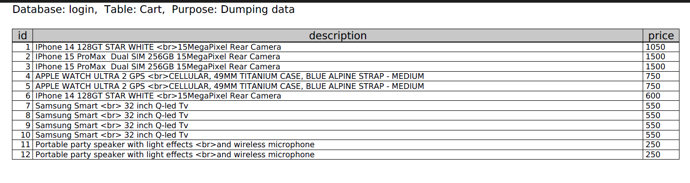
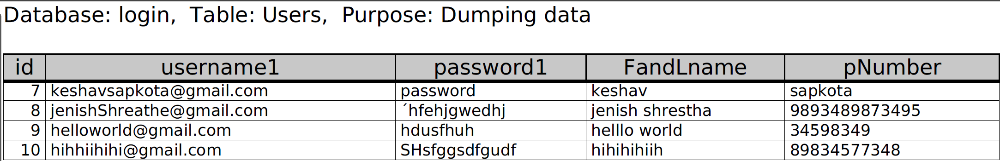

# Exercise 5: Readme.md

***Welcome to the task README!***

- You are required to create ´Readme.md´ in your project directory to document your activities throughout the project's lifecycle. 
- You will regularly update it to monitor the ongoing development of the project. 

- You will start by outlining the planned features, task assignments to team members and document the evolving progress of your work. 

- Below, you will find an example to help you get started. Feel free to customize it to match your specific requirements and needs.

# Project Name - Team Number

A brief description of your web development project.
Our project is all about shop of electronic items like wristwatches, cameras, phones, washing-machines.

## Table of Contents
- [Features](#features)
- [Database Tables](#database-tables)
- [Created Forms](#created-forms)
- [Created Tables](#created-tables)

---

## Features

In this section, list and describe the features or functionality that you are working on. You can use checkboxes to track the progress of each feature.

- [ ] Feature 1 (Keshav Sapkota): I am going to make a feature for a shopping cart. 
- [ ] Feature 2 (Jenish Shrestha): Work on User login.
- [ ] Feature 3 (Ijie Enaburekhan): Signup Features.
- [ ] Feature 4 (Yan Zheng): Work on production feedback.
> Add features as required.... 

### Feature 1

  In this user can add items to the shopping cart and can see the items in cart. If user already signup to our webpage they can have 10% discount. For discount you have signup through the login icon and after that you can apply discount by putting your username and the password. Provide links to related code files[Github writing to the database ](https://github.com/keshavsapkota3/Group_26-webprograming/blob/gh-pages/cart.php).    This is [Github Reading from the database](https://github.com/keshavsapkota3/Group_26-webprograming/blob/gh-pages/cart.php)  & link to the feature[shell.hamk.fi](http://shell.hamk.fi/~keshav22000/Group_26-webprograming/selecteditems.php).
  This feature allow user to add a item to  the shopping cart and it will show the total amounts of slected itmes and it will go upto checkout the items.

### Feature 2

In this features user can login if they have already signup, In login password and the user name must be same as the signup email and the password. After login user can view their profile detail and can delete or unregister  them from our website. Provide links to related code files [Github link login] (https://github.com/keshavsapkota3/Group_26-webprograming/blob/gh-pages/loginprocess.php) & link to the feature [shell.hamk.fi](http://shell.hamk.fi/~jenish22000/Group_26-webprograming/login.php) .

  In this feature  user login

### Feature 3

I have created the signUp page where user can register to our website. Provide links to related code files [][Github Link](https://github.com/keshavsapkota3/Group_26-webprograming/blob/gh-pages/signup.php) & link to the feature[Shell.hamk.fi] (http://shell.hamk.fi/~bbcap23_26/Group_26-webprograming/signup.php) .

   In this feature  will add multiple items to our database and overtime flash sales item will be change.


## Database Tables

List the database tables that are part of your project. 

- Table 1 (Created By Yan Zheng): Product_Reviews

```
[Product_Reviews]
+----------------+
| id             |
| product_id     |
| review         |
| review_time    |
+----------------+
```
- Table 2 (Keshav Sapkota): cart
 
- Table 3 (jenish Shrestha and Ijie Enaburekhan): Users
   
> Include the ER Diagram of the database. 

---


> Feel free to customize this README template to suit your project's specific needs. Providing clear and organized documentation will help your team members understand the project's progress and tasks effectively. This document will have a significant impact on the grading. 
